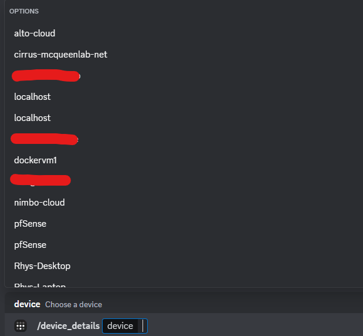
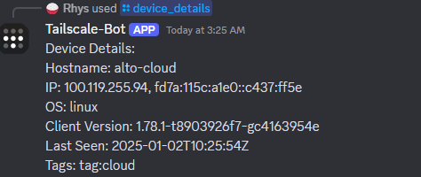
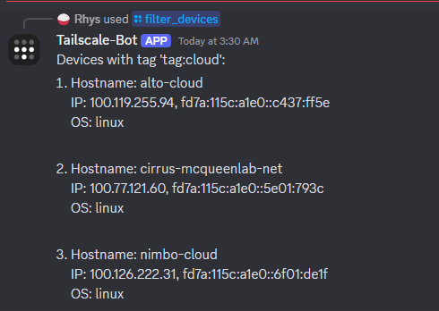
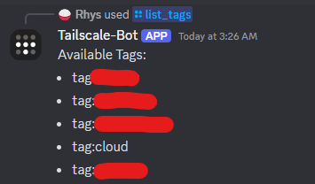
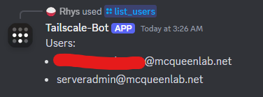
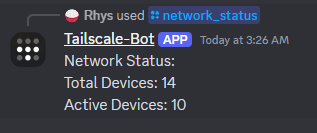

# Tailscale Discord Bot

## Overview
The **Tailscale Discord Bot** is a tool that integrates with Tailscale's API to provide network insights directly in Discord. It allows users to query active devices, filter by tags, get device details, and much more, all through a convenient set of slash commands.

``` docker pull ghcr.io/rhysmcqueen/tailscale-discord-bot/tailscale-discord-bot:latest ```
```
services:
  tailscale-discord-bot:
    image: ghcr.io/rhysmcqueen/tailscale-discord-bot:latest
    container_name: tailscale-discord-bot
    restart: unless-stopped
    environment:
      DISCORD_BOT_TOKEN: ${DISCORD_BOT_TOKEN}
      TAILSCALE_API_TOKEN: ${TAILSCALE_API_TOKEN}
      TAILSCALE_API_URL: ${TAILSCALE_API_URL}
```
---

## Features

### 1. Active Devices
Command: `/active_devices`  
List all currently active devices on your Tailscale network that were seen within the last 5 minutes.  


---

### 2. Device Details
Command: `/device_details`  
Fetch detailed information about a specific device, including hostname, IP addresses, operating system, and tags.  


---

### 3. Filter Devices by Tags
Command: `/filter_devices`  
Filter devices in your network by a specific tag. Useful for grouping devices by roles or access control.  


---

### 4. List Available Tags
Command: `/list_tags`  
Display all tags currently in use on your Tailscale network.  


---

### 5. List Users
Command: `/list_users`  
Retrieve a list of all users in the Tailscale network.  


---

### 6. Network Status
Command: `/network_status`  
Get a summary of the network, including total devices and the count of active devices.  


---

## Installatio
### 1. Clone the repository:
   ```bash
   git clone https://github.com/your-repo/tailscale-discord-bot.git
   cd tailscale-discord-bot
   ```

### 2. Install the required dependencies:
```bash
pip install -r requirements.txt
```
### 3. Create a Discord Application

1. Go to the [Discord Developer Portal](https://discord.com/developers/applications).
2. Click **New Application** and give it a name.
3. Navigate to the **Bot** tab:
   - Click **Add Bot** and confirm.
   - Under **Privileged Gateway Intents**, enable:
     - **Presence Intent**
     - **Server Members Intent**
     - **Message Content Intent** (if needed).
   - Click **Save Changes**.
4. In the **OAuth2** tab, go to the **URL Gener


### 4. Create a .env file:
```
DISCORD_BOT_TOKEN = "<your_discord_bot_token>"
GUILD_ID = "<your_discord_guild_id>"
CHANNEL_ID = "<your_discord_channel_id>"
TAILSCALE_API_TOKEN = "<your_tailscale_api_token>"
TAILSCALE_API_URL = "https://api.tailscale.com/api/v2/tailnet/<your_tailnet_name>/devices"
```
### 5. Run the bot:
```python
python tailscale-discord-bot.py
```

### Commands
|     Command     |                    Description                    |
|:---------------:|:-------------------------------------------------:|
| /active_devices | List active devices in the Tailscale network.     |
| /device_details | Get detailed information about a specific device. |
| /filter_devices | Filter devices based on a specific tag.           |
| /list_tags      | List all available tags in the network.           |
| /list_users     | List all users in the Tailscale network.          |
| /network_status | Display a summary of the network's status.        |
